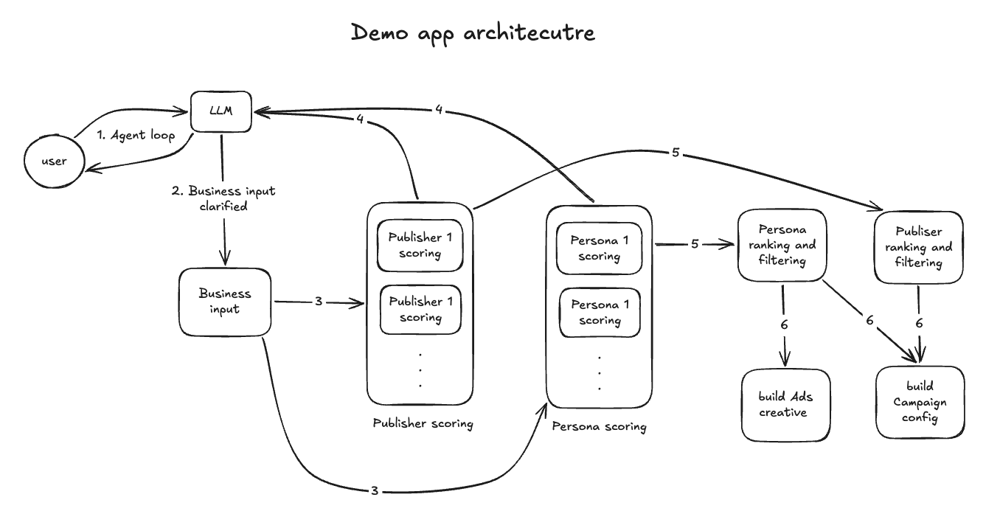
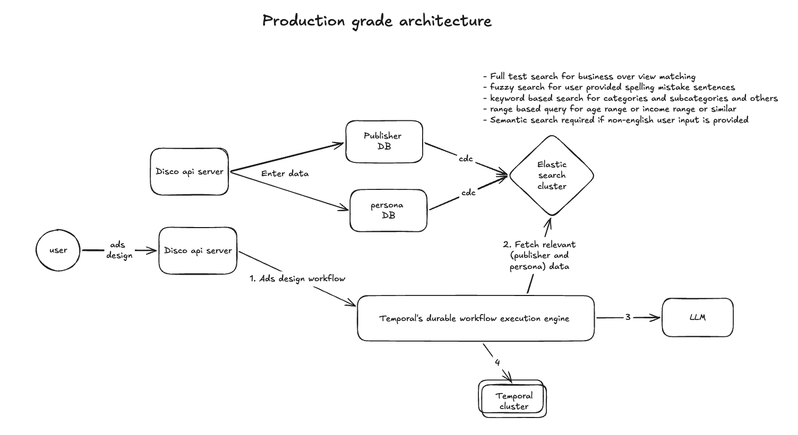

# Ad Placement & Creative Generation

An advertiser describes their business in a sentence. The system asks for
whatever it still needs, then produces a ranked publisher buy with reasons for
every inclusion *and* exclusion, persona-tuned ad copy, and a campaign config an
ad server could run.

The 20 publishers **are** the inventory — DTC brands selling placements on their
own checkout and post-purchase pages. This is commerce media, like Amazon Ads.
Nothing here is handed to Meta; publisher selection is the whole product.

## What I built



A conversational agent collects the brief (streamed token by token), then a
five-stage pipeline runs. The governing idea is **the model judges, code does
the arithmetic**: Gemini scores each publisher and persona on five attributes
with written reasons; Python computes the weighted composites, the budget
allocation and the unit economics. Composites are reproducible across runs and
checkable by hand — prose is where the model earns its place.

Scoring **fans out** — 20 publisher calls and 10 persona calls leave in one
burst under a semaphore. Judging does not: `catalog_fit` is a verdict on the
catalog as a whole, and "prefer distinct personas" can't be decided one persona
at a time. `publisher_reach` was the only thing tying personas to publishers, so
it moved into code as age/gender overlap, which freed both fan-outs to run
together. Every Gemini call uses an explicit `responseSchema`; nothing parses
free text. All prompts are in [`prompts/`](prompts/).

## How to run it

**Hosted:** <https://ads-design.onrender.com/> — free tier, so the first request
cold-starts for ~50 seconds. Give it a moment before assuming it's broken.

**Locally** (recommended — no cold start, no rate limits):

```bash
cp .env.example .env     # then set GEMINI_API_KEY in .env
docker compose up
```

Open <http://localhost:8080>. Click a sample brief, or type your own. `#7` (B2B
dental) and `#15` ("idk just try it") are the interesting ones.

## What I'd do next with another week

Three things are wrong with the current architecture.

**1 · Token cost doesn't scale.** Sending every publisher and persona to the LLM
works at 20 and 10. At thousands it's impossible. The fix is retrieval before
reasoning: index publishers and personas in Elasticsearch via a CDC pipeline,
and use the brief to pre-filter — full-text for the business overview, fuzzy for
typos, keyword for categories, range queries for age and income bands, and
semantic search once non-English input matters. Only the top matches reach the
model.

**2 · The workflow isn't durable.** A 70-second pipeline held in a background
task dies with the process. Temporal would persist workflow state and handle
retries and resumption without me building a job system.

**3 · Nothing is persisted.** In-memory dicts should become a document store.



## What I cut, and why

- **No pre-filtering.** With 20 publishers and 10 personas, Elasticsearch would
  be infrastructure with nothing to do. The cost only appears at scale.
- **No database.** In-memory is correct for a demo; a restart wiping sessions is
  stated in the UI rather than hidden.
- **No Temporal.** Durable execution earns its keep in production, not here.
- **No tests.** Deliberate, to spend the time on product. The deterministic core
  is pure and side-effect-free, and `backend/verify_pipeline.py` stubs every LLM
  call to assert the invariants that matter — budgets summing exactly, every
  publisher getting a verdict, headlines fitting 60 characters.

## What's genuinely hard

**Easy:** calling an LLM, rendering the output, the budget arithmetic.

**Hard, and where the interesting work lives:**

**Retrieval under a token budget.** Picking the right few hundred candidates
from thousands, in any language, is the difference between a demo and a product.
The ranking quality ceiling is set here, before the model sees anything.

**Knowing whether the output is any good.** Everything in this repo optimises a
proxy — score spread, honest exclusions, copy that respects `disinterested_in`.
None of it proves the campaign *performs*. The real system needs a closed
feedback loop from delivery data back into the pipeline, and then the hard part
is attribution: when CPA comes in above break-even, was it the retrieval, a
scoring node, the prompt, the model, or the workflow shape? Without that loop
you are tuning prompts on vibes. Building it is the actual engineering problem.
